# Tencent_live <!-- omit in toc -->

- [PCG 线上直播](#pcg-线上直播)
  - [PCG 平台和内容事业群（腾讯目前最大事业群）](#pcg-平台和内容事业群腾讯目前最大事业群)
    - [社交平台](#社交平台)
    - [内容商业平台](#内容商业平台)
    - [内容创造平台](#内容创造平台)
  - [未来三大方向](#未来三大方向)
- [PCG 数据科学相关](#pcg-数据科学相关)
  - [国内数据科学的现状](#国内数据科学的现状)
  - [DS在PCG的机会](#ds在pcg的机会)
  - [DS领域，回国的一些建议？](#ds领域回国的一些建议)
  - [DS核心竞争力是什么](#ds核心竞争力是什么)
  - [PCG数据科学的最大挑战](#pcg数据科学的最大挑战)
  - [PCG的算法布局](#pcg的算法布局)
    - [内容多样性 需求多样性](#内容多样性-需求多样性)
    - [直观的应用分享](#直观的应用分享)
      - [AI 智能人体轮廓塑形技术](#ai-智能人体轮廓塑形技术)
      - [视频质量提升](#视频质量提升)
      - [人体姿态迁移](#人体姿态迁移)
      - [二维转三维](#二维转三维)
      - [基于识别的追星神器](#基于识别的追星神器)
      - [AR效果](#ar效果)
      - [实时卡通画生成](#实时卡通画生成)
      - [3维卡通动画](#3维卡通动画)
      - [自动写稿](#自动写稿)
      - [自动配图](#自动配图)
      - [内容和质量审核](#内容和质量审核)
      - [人脸聚类](#人脸聚类)

## HR

allieshen@tencent.com

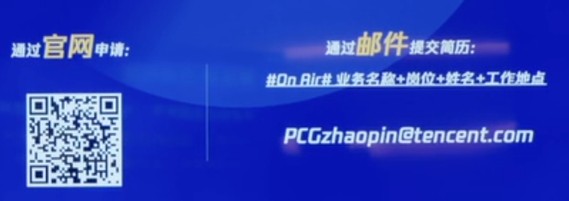

# PCG 线上直播

Plantform and Content Group
```
其他各个事业群

TEG

WXG

IEG

CSIG

CDG
```

## PCG 平台和内容事业群（腾讯目前最大事业群）

目标，让内容创造美好

### 社交平台

* qq

* Tim

卡位用户流量

始终立足于青年人社交，储蓄探索

未来更多偏向小团队合作，下一期的重点，提供写作社交平台

* Tim

* 腾讯文档

更多新社区产品

* 朋友

* 波洞

新创新场景

* 卡噗

* 猜歌星球

### 内容商业平台

* 腾讯视频
* 腾讯新闻
* qq浏览器
* 快报
* 微视
* 腾讯体育
* 应用宝

### 内容创造平台

* 企鹅影业
* 腾讯影业
* 腾讯动漫


## 未来三大方向

**第一方向：社交是腾讯的核心赛道，也是PCG的核心。2020年qq可能会有较大迭代更新**

**第二方向：平台建设**
1. 海量作者的内容生态经济体建设
2. 推荐技术驱动下的用户体验优化
3. 视频领域的新机会探索

**第三方向IP 开发 - case 斗罗大陆**
腾讯有全平台覆盖生态优势
多平台创造传播好内容-case 腾讯体育NBA 合作

# PCG 数据科学相关

Elise 腾讯视频

Gavin 微视，大数据

Eilbot 腾讯看点，数据平台

## 国内数据科学的现状

Eilbot：

四个方面

1. 意识
认可度高，国家 - 数据是新的生产要素之一： 从数据中挖掘价值，数据有很大的商业价值。如何挖掘这一方向需要人才。

2. 应用

3. 人才
起步较晚，人才储备较为薄弱

4. 前景
潜力巨大

Gavin ：

从鲜为提及到炙手可热。随着业务长的复杂化，对业务，统计学，机器学习复合型人才有比较高的需求。渴望多背景的人才

Elise：

很赞同，数据科学算是比较新的。

分享了一下个人转型的考虑

* challenge 挑战：
希望可以专注解决一个问题
* impact 影响：
希望解决的问题有团队社会价值
* people 团队：
很看重团队质量

## DS在PCG的机会

Elise：

腾讯是一种创业小公司+大型公司的结合
因为数据量很大，所以对数据科学分析很有利

但是内容的转型很有挑战，case 长视频到短视频，推荐的方式就不太一样。

总结就是腾讯有个很好的场景和平台来应用数据科学的知识

Gavin：

对短视频感兴趣，而且DS在这方面很有价值

短视频是一种更新的媒体形式，内容浓缩高

BC两端的供需平衡

匹配和分发，激励生产设生产多元内容满足多元需求

社交平台，强链接的好友关系，弱连接的关注关系，如何激励，是让数据科学家很激动的事情。

Eibot：

DS在PCG的发展，两个因素

* 价值洼地：
当前整个数据在PCG的应用还比较初级，数据还未被深度挖掘

* 价值天花板
在架构，在PCG整体来看，IP结合，社交关系链，是可以深度挖掘的，会有很多有潜力的关系待发展

产品经理往往是从浅层分析，传统数据分析是不好对细颗粒的数据进行挖掘的。新一代的数据科学家是可以在更大规模更细颗粒数据中挖掘数据的。并且再通过工程化方法将这些结果分享给经理，带来更多的启示。

相信数据科学是可以在这一方面给与更多的助力

起点低，天花板高

## DS领域，回国的一些建议？

Elise：
回来5个月了，

职业选择的三个维度：
challenge
impact
people

Case 兄弟团队的支持，问题解决的成就感，拥抱技术改变应用，很符合自己的expectation

人文也很符合自己的感觉

很喜欢看电视，所以用自己的专业知识研究自己喜欢的东西，个人很有满足感。

也有家里的考量，文化的传承。

Gavin
建议：
要有预期，对不同的预期

要做调研，企业文化
一落地就能发挥自己价值的地方
如何适应落地

心态上保持开放

Eibot：
竞争力的担心，不用担心，但是要做好心理准备

核心是能不能全身心投入，能不能自己有owner的态度。也就是主人翁精神，坚定并有耐心。


时间点？
Gavin：
当你遇到瓶颈的时候，考虑回国是否能突破

有时候你学的够多了，回国可能会给你更广阔的天地去施展

不少方面是领先于硅谷的，像是体系化的数据建设。相信回国是可以让你持续突破自己的。

总结：当你觉得自己遇到了瓶颈，可以考虑回国，借助机会来突破自己

## DS核心竞争力是什么


## PCG数据科学的最大挑战

Eilbot：

腾讯看点的角度

两个角度：

1. 理念，认知，文化

DS属于初创的概念，对其认知理解的宽度和深度是不一样的，在推动的时候沟通的成本是较大的，但这同时也是一个机会，更有机会输出自己的理念

2. 基础设施

PCG一开始没有对DS这方面进行建设，很多事从零开始打造，所以给了自己很多机会来打造DS在业务中的理念。

## PCG的算法布局

应用研究中心的大佬

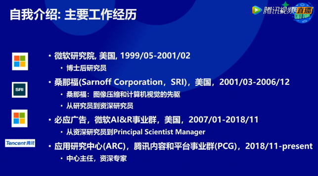

### 内容多样性 需求多样性

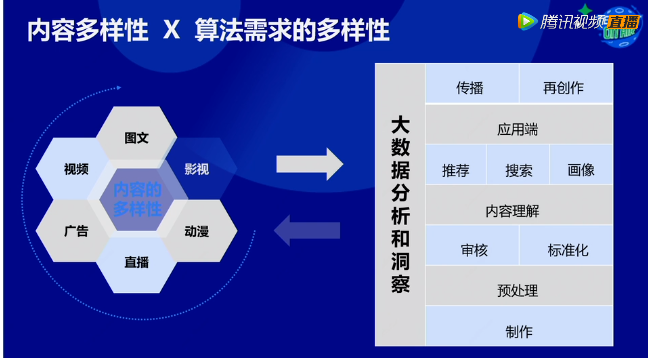

### 直观的应用分享

#### AI 智能人体轮廓塑形技术

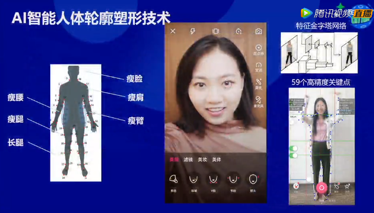

这里涉及到

Video object技术

挑战

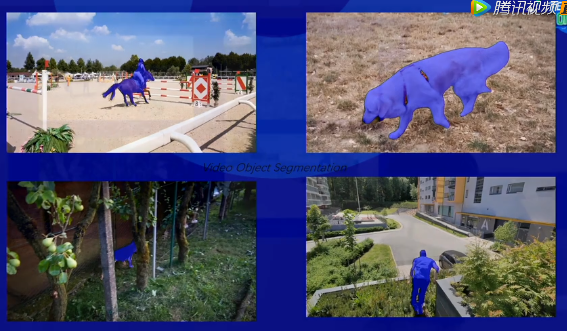

* 物体前有遮挡
* 物体颜色和背景接近
* 物体运动场景变化多

更多应用

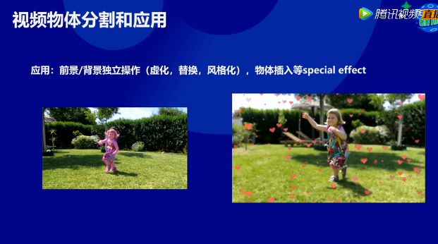

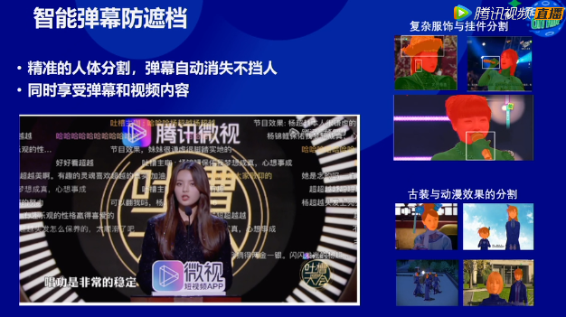

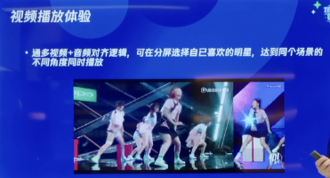

#### 视频质量提升

* 超分辨率
* HDR增强
* 慢动作
* 一键编辑 -> 增强配乐

#### 人体姿态迁移

上传自己的全身照，可以直接模拟一个舞蹈

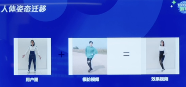


#### 二维转三维

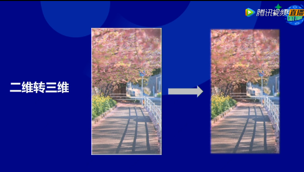

#### 基于识别的追星神器

只看某一明星的出场片段

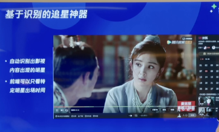

#### AR效果

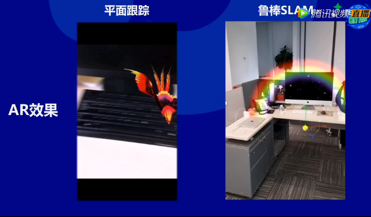

#### 实时卡通画生成

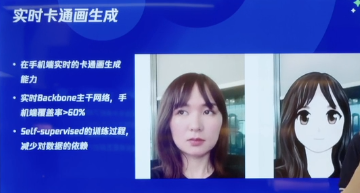

#### 3维卡通动画

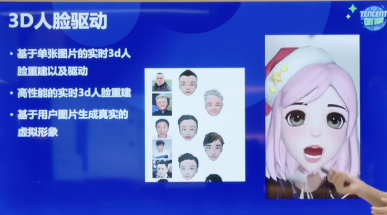

#### 自动写稿

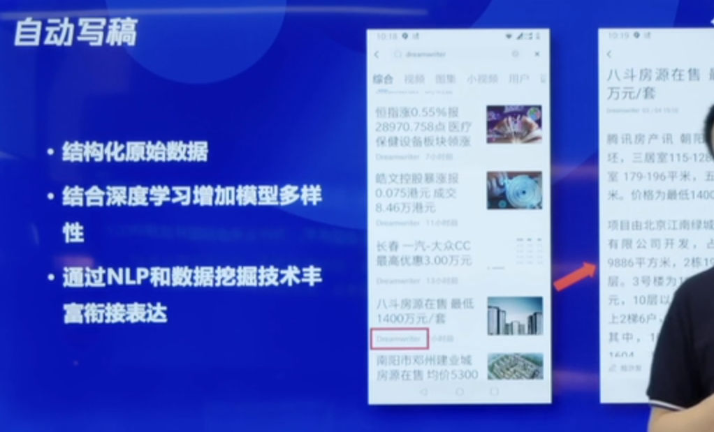

#### 自动配图

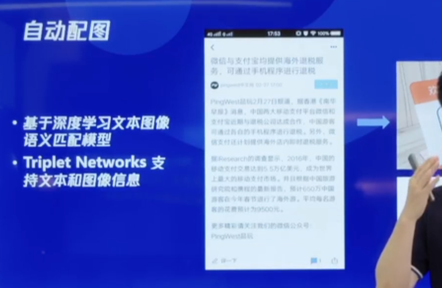

#### 内容和质量审核

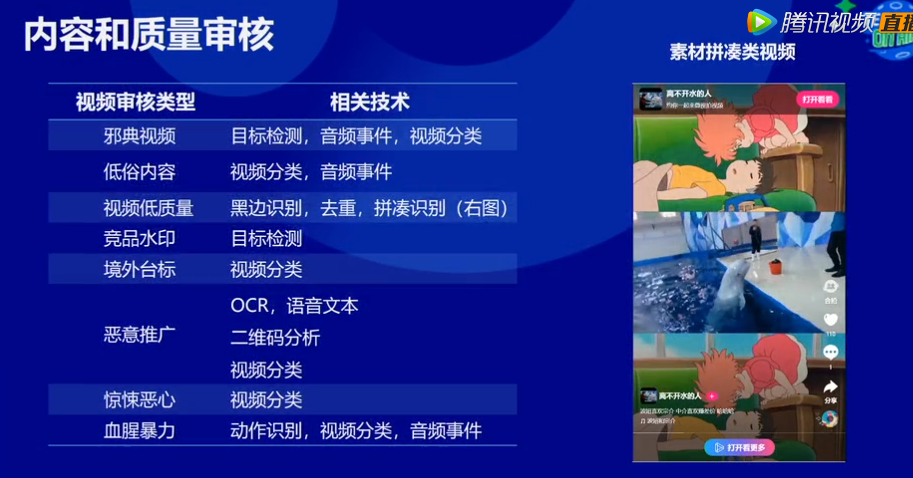

#### 人脸聚类

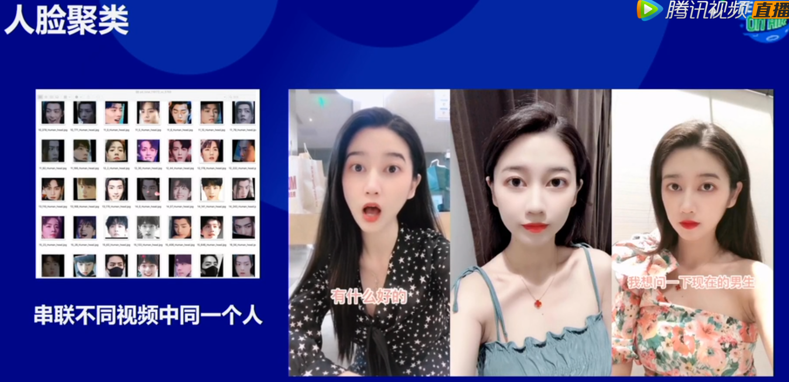